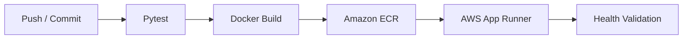

# AWS CI/CD Pipeline — FastAPI

**From code push to containerized AWS deployment through an automated delivery pipeline.**

FastAPI · Pytest · Docker · GitHub Actions · Amazon ECR · AWS App Runner

## Engineering goal

This project demonstrates a repeatable CI/CD path for a containerized FastAPI service: validate the application, build an image, publish the artifact and deploy it to AWS.

The application and infrastructure are intentionally separated:

- **Application:** `DavidDevd/devops.ci.api`
- **Infrastructure:** `DavidDevd/devops.ci.iac`

## Delivery architecture



This pipeline makes the delivery path inspectable and repeatable instead of relying on manual build and deployment steps.

## What this project demonstrates

- FastAPI service with health and runtime endpoints;
- automated tests with Pytest;
- container image creation with Docker;
- GitHub Actions CI/CD workflow;
- image publishing to Amazon ECR;
- AWS App Runner as deployment target;
- post-deployment health validation;
- separation between application and Infrastructure as Code repositories.

## API surface

| Method | Endpoint | Purpose |
| --- | --- | --- |
| `GET` | `/` | API metadata |
| `GET` | `/health` | Health check |
| `GET` | `/info` | Runtime environment information |

## Run locally

```bash
pip install -r app/requirements.txt
uvicorn app.main:app --reload --port 8000
```

Run tests:

```bash
pytest tests/
```

Run as a container:

```bash
docker build -t davops-api .
docker run -p 8000:8000 -e ENV=local davops-api
```

## Pipeline stages

```text
01 CODE
   ↓
02 TEST
   ↓
03 BUILD
   ↓
04 PUBLISH TO ECR
   ↓
05 DEPLOY TO APP RUNNER
   ↓
06 VALIDATE HEALTH
```

## Infrastructure

The infrastructure side of this case is maintained separately so application delivery and cloud provisioning remain distinct concerns.

**IaC repository:** [devops.ci.iac](https://github.com/DavidDevd/devops.ci.iac)

## Skills demonstrated

**DevOps** — CI/CD, automation and repeatable delivery  
**Containers** — Docker image lifecycle  
**AWS** — ECR and App Runner delivery path  
**Backend** — FastAPI service and health endpoints
